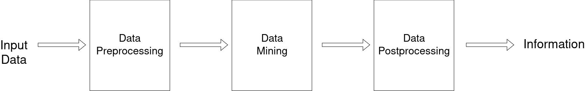

# Purpose of this Notebook
This notebook is created by me to  review the topics I have seen in Data Mining course.

``environment.yml`` file is available at the root directory of the project.

To create an environment with the file that is located on this repository, run the following command line:


```bash
conda env create -f environment.yml
```

# About Repository
This repository will follow the shared guidelines below for commiting.
This will allow reader to follow code repository history.
My name is Ali Talip. You can contact me with `alitalip18@gmail.com`.

## Commit Message Header
### Feat 
This message is used for emphasizing the feature implementation for the repository with explanations.

## Fix 
Fix header is used for clarifying that the commit is about removing a bug in program flow. It also contains further explanations about the fix process.

## Docs 
This header is used for changes to the documentation like README.


## Perf
`Perf` header is used when the commit improves code performance.


# Dataset
This dataset is originally from the National Institute of Diabetes and Digestive and Kidney Diseases. The objective of the dataset is to diagnostically predict whether or not a patient has diabetes, based on certain diagnostic measurements included in the dataset. Several constraints were placed on the selection of these instances from a larger database. In particular, all patients here are females at least 21 years old of Pima Indian heritage.

It is contained from ``https://www.kaggle.com/organizations/uciml``

# Data Mining Course Review
Data mining is a process to obtain meaningful patterns and relationships from data. These relationships may be helpful to solve business problems. It helps businesses to plan their future actions.



## Data Preprocessing
This step contains feature selection, feature extraction and dimentionality reduction.

## Data Mining
The machine learning models are used in this section for reaching out to the patterns of the data.

## Data Postprocessing
The visualizations and data representations are done in here. After this step, the target information may be reached.
